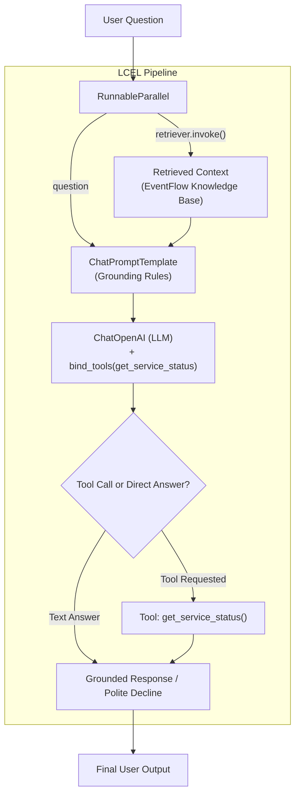

# EventFlow Internal Knowledge Assistant (v1)

[](https://deepmind.google/)
[](https://www.langchain.com/)
[](https://smith.langchain.com/)

A resilient, grounded internal knowledge assistant for **EventFlow** built with **LangChain (LCEL)**, custom retrieval, tool-calling capabilities, and LangSmith observability — developed and architected with **AI - Antigravity**.

---

## Architecture Overview

The assistant uses **LangChain Expression Language (LCEL)** to decouple context retrieval, prompt construction, model execution, and tool routing into a declarative pipeline.



---

## Key Features

1. **Grounded Question Answering (RAG):**
   * Answers questions strictly based on internal EventFlow documentation snippets (Redis caching, PostgreSQL persistence, booking service, seat holds, MongoDB notifications).
2. **Graceful Declining (No Hallucinations):**
   * When asked an out-of-scope question with no relevant snippet (e.g., *"Who is the CEO?"*), the assistant explicitly states:
     > *"I don't have enough information in the provided knowledge base to answer that."*
3. **Tool Calling Integration:**
   * Bound with `get_service_status` tool to fetch real-time infrastructure metrics (Redis, PostgreSQL, MongoDB).
4. **Decoupled Retriever Architecture:**
   * Swapping `ToyRetriever` for a production vector store (Chroma, FAISS, Pinecone) requires **zero changes** to the LCEL chain, prompt, or model.
5. **Observability:**
   * Fully integrated with **LangSmith** for trace inspection, token usage, latency metrics, and debugging.

---

## Getting Started (Zero-Context Setup)

Follow these steps to run the assistant locally from scratch.

### 1. Prerequisites
* **Python 3.10+** installed
* An API key from [OpenRouter](https://openrouter.ai/) (or OpenAI)

### 2. Clone the Repository
```bash
git clone https://github.com/usharani222/AI.git
cd AI/LangChain/Internal_Knowledge_Assistant\ v1
```

### 3. Create and Activate a Virtual Environment
* **Windows (PowerShell):**
  ```powershell
  python -m venv venv
  .\venv\Scripts\Activate.ps1
  ```
* **macOS / Linux:**
  ```bash
  python3 -m venv venv
  source venv/bin/activate
  ```

### 4. Install Dependencies
```bash
pip install -r requirements.txt
```

### 5. Configure Environment Variables
Copy the `.env.example` file to `.env`:
```bash
cp .env.example .env
```
Open `.env` and fill in your API key:
```env
OPENROUTER_API_KEY="your_actual_openrouter_api_key_here"

# Optional: LangSmith Tracing
LANGSMITH_TRACING="true"
LANGSMITH_API_KEY="your_langsmith_api_key_here"
LANGSMITH_PROJECT="internal-knowledge-assistant"
```

---

## Running the Assistant

Run the assistant script directly:

```powershell
python .\knowledge.py
```

### Demo Recording

🎥 **Recorded Demonstration:**
* Watch the recorded walkthrough: [▶️ View Demo Video (`.mp4`)](./AI%20-%20Antigravity%20IDE%20-%20.env%202026-09-23%2015-45-06.mp4)

<video src="./AI%20-%20Antigravity%20IDE%20-%20.env%202026-09-23%2015-45-06.mp4" controls width="100%"></video>

### Expected Output Log

```
======================================================================
EVENTFLOW INTERNAL KNOWLEDGE ASSISTANT (DAY 21 CHECKPOINT)
======================================================================

Test 1: What is PostgreSQL used for in EventFlow?
Answer: PostgreSQL in EventFlow is used to store users, events, and booking information.
----------------------------------------------------------------------
Test 2: Why is Redis used in the platform?
Answer: Redis is used to temporarily hold seats during booking and prevent concurrent reservations.
----------------------------------------------------------------------
Test 3: What does the booking service handle?
Answer: The booking service handles booking creation and confirmation.
----------------------------------------------------------------------
Test 4: Who is the CEO of EventFlow?
Answer: I don't have enough information in the provided knowledge base to answer that.
----------------------------------------------------------------------
Test 5: What is the live operational status of Redis?
Answer: [Tool Used: get_service_status] Status: Operational (0% packet loss, memory 42% used)
----------------------------------------------------------------------
```

---

## Running Tests

Unit tests for prompts, tools, and mocked parsers are located in `../test_assistant.py`. Run:

```powershell
pytest -v ..\test_assistant.py
```

**Test Results:**
```
test_assistant.py::test_prompt_template_rendering PASSED                 [ 33%]
test_assistant.py::test_tool_return_value_given_fixed_input PASSED       [ 66%]
test_assistant.py::test_output_parser_with_mocked_llm_response PASSED    [100%]
============================== 3 passed in 2.63s ==============================
```

---

## Day 27 Checkpoint FAQ

> **Checkpoint Question:**  
> *If you handed this repo to someone with zero context, would the README alone get them to a running demo?*

**Answer:**  
**Yes.** The README contains the complete end-to-end setup guide:
1. Exact Python environment creation commands.
2. `requirements.txt` to install all necessary packages in one line.
3. `.env.example` template with clear API key instructions.
4. Single-command execution (`python knowledge.py`).
5. Expected input/output benchmarks so the user can immediately verify their local setup is working properly.
