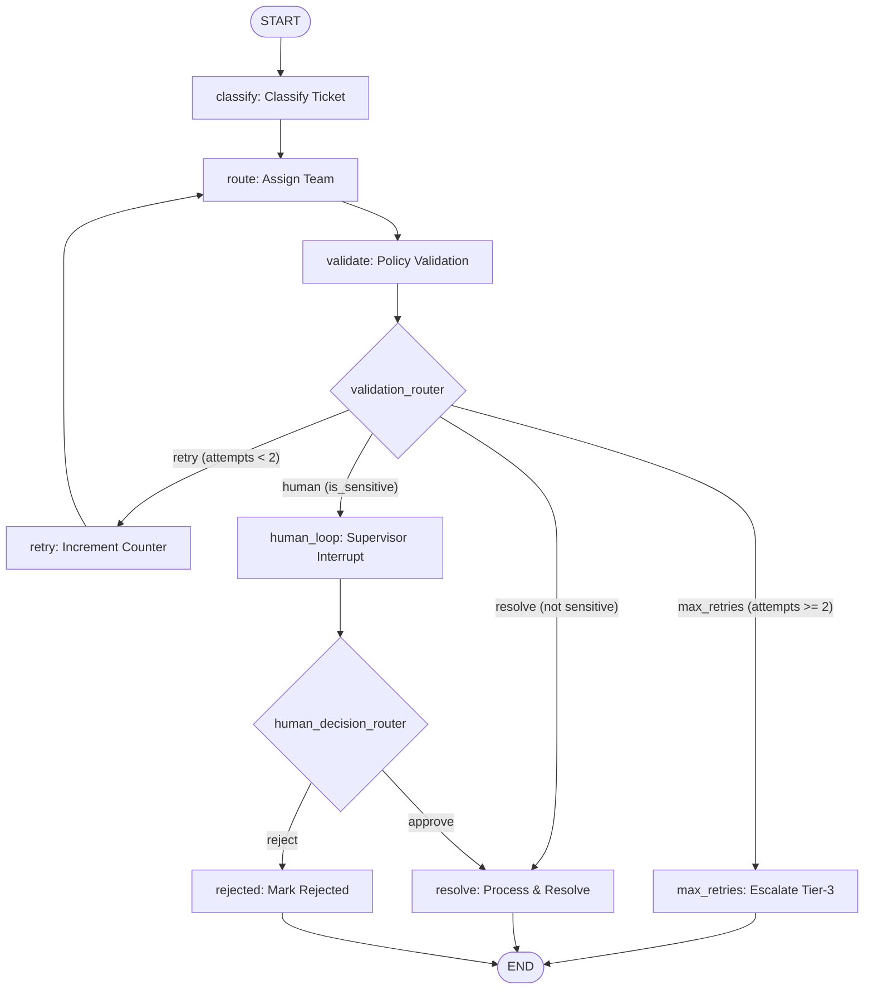

# Enterprise Ticket Support System (LangGraph)

An automated support ticket classification, routing, policy validation, and resolution engine built with **LangGraph**. The system features **loops with retry limits**, **human-in-the-loop (HITL) authorization interrupts**, and **in-memory checkpointing**.

---

## 1. Graph Architecture Diagram

### Mermaid Flowchart


### ASCII Flow Diagram
```text
                     ┌─────────┐
                     │  START  │
                     └────┬────┘
                          │
                          ▼
                    ┌────────────┐
                    │  classify  │
                    └─────┬──────┘
                          │
                          ▼
                    ┌────────────┐
             ┌─────►│   route    │
             │      └─────┬──────┘
             │            │
             │            ▼
             │      ┌────────────┐
             │      │  validate  │
             │      └─────┬──────┘
             │            │
             │            ▼
             │  /───────────────────\
             │ <  validation_router  >
             │  \───────────────────/
             │     │      │        │
      retry  │     │      │ valid  │ max_retries (>=2)
   (att < 2) │     │      ▼        ▼
       ┌─────┘     │  sensitive? ┌─────────────┐
       │           │   /       \ │ max_retries │──► END
┌──────┴──────┐    │  NO       YES└─────────────┘
│    retry    │    │  │         │
│ (count + 1) │    │  ▼         ▼
└─────────────┘    │┌───────┐ ┌────────────┐
                   ││resolve│ │ human_loop │ (interrupt)
                   │└───┬───┘ └─────┬──────┘
                   │    │           │
                   │    │           ▼
                   │    │   /──────────────────────\
                   │    │  < human_decision_router  >
                   │    │   \──────────────────────/
                   │    │      │               │
                   │    │   approve         reject
                   │    │      │               │
                   │    │      ▼               ▼
                   │    │  ┌───────┐      ┌──────────┐
                   │    └─►│resolve│      │ rejected │──► END
                   │       └───┬───┘      └──────────┘
                   │           │
                   └───────────┼──────────► END
                               ▼
                            ┌─────┐
                            │ END │
                            └─────┘
```

---

## 2. State Schema (`SupportTicketState`)

The state is managed using Python's `TypedDict`:

| Field | Type | Description |
| :--- | :--- | :--- |
| `ticket_id` | `int` | Unique ticket identifier. |
| `ticket_text` | `str` | Raw input text of the ticket issue. |
| `category` | `str` | Derived category: `"technical"`, `"billing"`, `"general"`, or `"unclassified"`. |
| `assigned_team` | `str` | Assigned team: `"technical"`, `"support"`, `"general_support"`, or `"unassigned"`. |
| `is_valid` | `bool` | Whether the classification-to-team assignment meets policy constraints. |
| `is_sensitive` | `bool` | High-risk/financial flag requiring supervisor sign-off. |
| `attempt_count` | `int` | Number of validation retry attempts made. |
| `approval` | `str` | Human supervisor input (`"approved"`, `"rejected"`). |
| `status` | `str` | Final lifecycle status (`"resolved"`, `"rejected"`, `"escalated_max_retries"`). |
| `resolution_notes`| `str` | Audit log describing the outcome. |

---

## 3. Node Responsibilities

1. **`classify` (`classification_node`)**:
   - Parses ticket text using keyword heuristics.
   - Categorizes into `technical`, `billing`, `general`, or `unclassified`.
2. **`route` (`route_node`)**:
   - Maps category to the designated enterprise team according to policy:
     - `billing` $\rightarrow$ `support`
     - `technical` $\rightarrow$ `technical`
     - `general` $\rightarrow$ `general_support`
3. **`validate` (`validate_node`)**:
   - Confirms that the assignment matches enterprise compliance policies.
   - Sets `is_valid = True` or `is_valid = False`.
4. **`retry` (`retry_node`)**:
   - Increments `attempt_count += 1` upon validation failure.
   - Loops back to `route` for re-evaluation.
5. **`human_loop` (`human_loop_node`)**:
   - Invokes `interrupt(...)` with context (ticket ID, text, category, prompt).
   - Pauses graph execution until supervisor submits a decision via `Command(resume=...)`.
6. **`resolve` (`resolve_node`)**:
   - Marks the ticket status as `"resolved"`.
7. **`rejected` (`handle_rejected_node`)**:
   - Handles tickets rejected by the supervisor during HITL review.
8. **`max_retries` (`handle_max_retries_node`)**:
   - Escalates tickets that fail validation across multiple retries to Tier-3 Operations.

---

## 4. Conditional Edge Routing

### `validation_router`
- `state["is_valid"] == True` and `is_sensitive == True` $\rightarrow$ `"human"` (`human_loop`)
- `state["is_valid"] == True` and `is_sensitive == False` $\rightarrow$ `"resolve"` (`resolve`)
- `state["is_valid"] == False` and `attempt_count < 2` $\rightarrow$ `"retry"` (`retry`)
- `state["is_valid"] == False` and `attempt_count >= 2` $\rightarrow$ `"max_retries"` (`max_retries`)

### `human_decision_router`
- `approval in ["approve", "approved", "yes", "accept"]` $\rightarrow$ `"resolve"` (`resolve`)
- `approval` otherwise $\rightarrow$ `"reject"` (`rejected`)

---

## 5. Human-in-the-Loop (HITL) Execution

When a ticket is flagged with `is_sensitive = True`:
1. The graph executes until `human_loop`, where `interrupt(...)` pauses the thread.
2. The checkpointer (`InMemorySaver`) preserves the thread state under `thread_id = "ticket-thread-<ID>"`.
3. An external supervisor or system reviews the snapshot via `app.get_state(config)`.
4. The workflow is resumed by calling:
   ```python
   app.invoke(Command(resume="approve"), config=config)  # or resume="reject"
   ```

---

## 6. Test Suite: 10 Varied Tickets End-to-End

The test suite in [`ticket_support_system.py`](file:///c:/Users/usha7/OneDrive/Desktop/USHA-AI/AI/LangGraph/ticket_support_system.py) processes 10 varied ticket scenarios:

| ID | Issue Description | Sensitive | Path Traversed | Outcome |
| :---: | :--- | :---: | :--- | :--- |
| **101** | Production database timeout error | No | classify $\rightarrow$ route $\rightarrow$ validate $\rightarrow$ resolve | **RESOLVED** (Technical) |
| **102** | Duplicate charge on monthly invoice | No | classify $\rightarrow$ route $\rightarrow$ validate $\rightarrow$ resolve | **RESOLVED** (Support) |
| **103** | API documentation inquiry | No | classify $\rightarrow$ route $\rightarrow$ validate $\rightarrow$ resolve | **RESOLVED** (General) |
| **104** | Emergency $50,000 refund request | **Yes** | validate $\rightarrow$ `human_loop` [PAUSE] $\rightarrow$ **Approved** $\rightarrow$ resolve | **RESOLVED** (HITL Approved) |
| **105** | Suspicious crypto wallet transfer | **Yes** | validate $\rightarrow$ `human_loop` [PAUSE] $\rightarrow$ **Rejected** $\rightarrow$ rejected | **REJECTED** (HITL Rejected) |
| **106** | Frontend CSS alignment issue | No | classify $\rightarrow$ route $\rightarrow$ validate $\rightarrow$ resolve | **RESOLVED** (Technical) |
| **107** | Invoice billing address update | No | classify $\rightarrow$ route $\rightarrow$ validate $\rightarrow$ resolve | **RESOLVED** (Support) |
| **108** | Routing glitch with validation failure | No | validate (Fail) $\rightarrow$ `retry #1` $\rightarrow$ route $\rightarrow$ validate (Pass) $\rightarrow$ resolve | **RESOLVED** (1 Retry) |
| **109** | GDPR PII database deletion request | **Yes** | validate $\rightarrow$ `human_loop` [PAUSE] $\rightarrow$ **Approved** $\rightarrow$ resolve | **RESOLVED** (HITL Approved) |
| **110** | Corrupted unclassifiable payload | No | validate (Fail) $\rightarrow$ `retry #1` $\rightarrow$ `retry #2` $\rightarrow$ `max_retries` | **ESCALATED_MAX_RETRIES** |

---

## 7. How to Run

Execute the script using the project's virtual environment:

```powershell
# From the LangGraph directory:
python ticket_support_system.py
```
